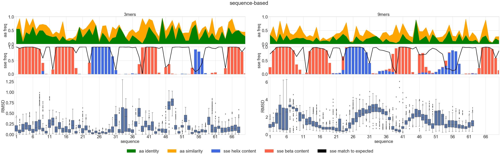
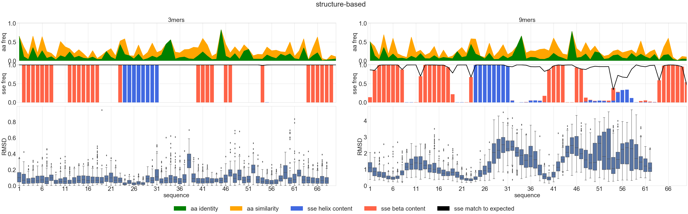
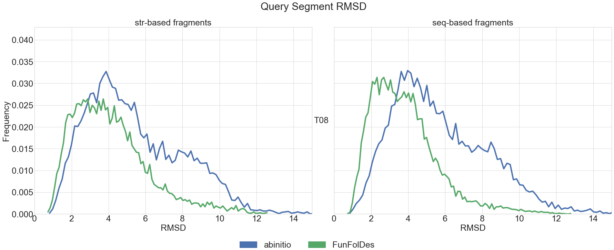
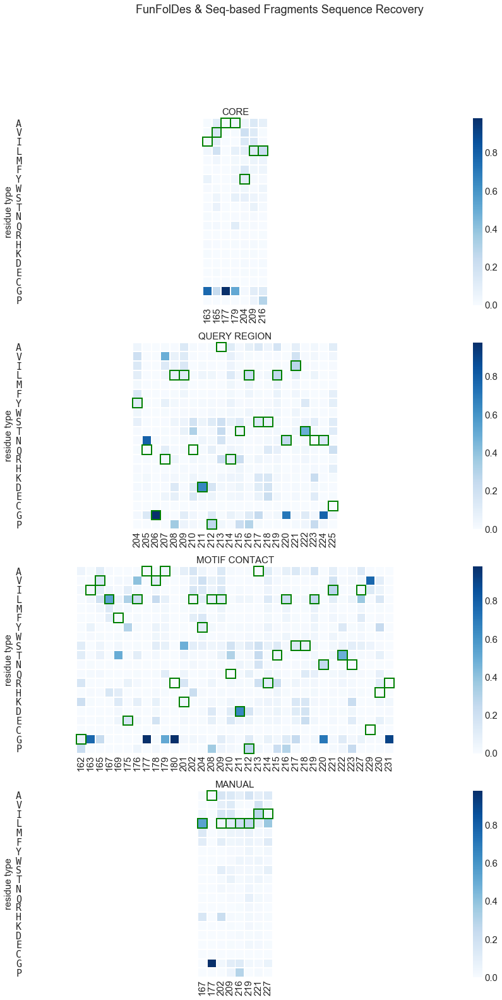
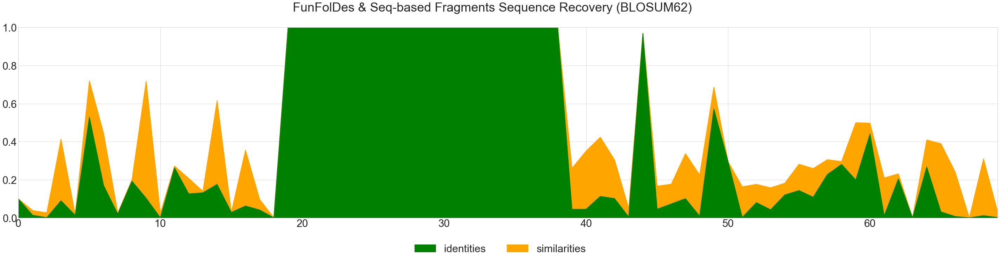
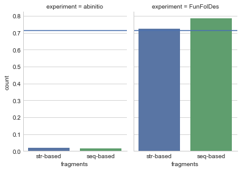

```python
# base libraries
import warnings; warnings.simplefilter('ignore')
import os
import sys

# external libraries
import matplotlib
import matplotlib.pyplot as plt
import pandas as pd
import seaborn as sns
from IPython.display import display_javascript, display_html, display

# local libraries
sys.path.append(os.path.abspath("../"))
import readme_utils

matplotlib.rcParams['svg.fonttype'] = 'none'
pd.set_option('display.max_columns', None)
sns.set_style("whitegrid")
sns.set_palette('deep')
```

# Load baseline data for the Benchmark


```python
info = readme_utils.io.load_benchmark_info( "_info.yaml" )
readme_utils.plot.show_info( info )
```


<div style="width:100%;">
    <table style="width:60%;margin-left:20%">
        <tr style="border-top: 3px solid black;border-bottom: 1px solid black;">
            <th colspan="6" style="text-align:center;" >Benchmark</th>
        </tr>
        <tr>
            <th colspan="2" style="text-align:center;" >ID</th>
            <th colspan="2" style="text-align:center;" >CATH</th>
            <th colspan="2" style="text-align:center;" ># motifs</th>
        </tr>
        <tr>
            <td colspan="2" style="text-align:center;" >T08</td>
            <td colspan="2" style="text-align:center;" >CATH.3.10.20.90</td>
            <td colspan="2" style="text-align:center;" >1</td>
        </tr>
        <tr style="border-top: 3px solid black;border-bottom: 1px solid black;">
            <th colspan="6" style="text-align:center;" >Structures</th>
        </tr>
        <tr>
            <th colspan="3" style="text-align:center;" >Query</th>
            <th colspan="3" style="text-align:center;" >Reference</th>
        </tr>
        <tr>
            <td colspan="3" style="text-align:center;" >1wiaA.pdb</td>
            <td colspan="3" style="text-align:center;" >1wj4a.pdb</td>
        </tr>
        <tr style="border-top: 3px solid black;border-bottom: 1px solid black;">
            <th colspan="6" style="text-align:center;" >Design</th>
        </tr>
        <tr>
            <th colspan="2" style="text-align:center;" >motif</th>
            <th colspan="2" style="text-align:center;" >chain</th>
            <th colspan="2" style="text-align:center;" >sequence shift</th>
        </tr>
        <tr>
            <td colspan="2" style="text-align:center;" >181-200</td>
            <td colspan="2" style="text-align:center;" >A</td>
            <td colspan="2" style="text-align:center;" >162</td>
        </tr>
        <tr style="border-top: 3px solid black;">
            <th colspan="2" style="text-align:center;border-right: 1px solid black;" >Experiments</th>
            <td colspan="2" style="text-align:center;" >abinitio</td>
            <td colspan="2" style="text-align:center;" >FunFolDes</td>
        </tr>
        <tr style="border-top: 3px solid black;border-bottom: 1px solid black;">
            <th colspan="6" style="text-align:center;" >Fragment types</th>
        </tr>
        <tr>
            <th colspan="2" style="text-align:center;" >sequence-based</th>
            <td colspan="4" style="text-align:left;" >Standard Rosetta fragment generation (sequence-based data)</td>
        </tr>
        <tr>
            <th colspan="2" style="text-align:center;" >structure-based</th>
            <td colspan="4" style="text-align:left;" >Automatic fragment generation (secondary structure + angles + sasa)</td>
        </tr>
    </table>
    </div>


```python
base = readme_utils.io.load_baseline(info)
base
```


<div>
<style scoped>
    .dataframe tbody tr th:only-of-type {
        vertical-align: middle;
    }

    .dataframe tbody tr th {
        vertical-align: top;
    }

    .dataframe thead th {
        text-align: right;
    }
</style>
<table border="1" class="dataframe">
  <thead>
    <tr style="text-align: right;">
      <th></th>
      <th>score</th>
      <th>lbl_CORE</th>
      <th>lbl_PICKED</th>
      <th>lbl_MOTIF</th>
      <th>lbl_QUERY</th>
      <th>sequence_A</th>
      <th>structure_A</th>
      <th>lbl_CONTACTS</th>
    </tr>
  </thead>
  <tbody>
    <tr>
      <th>0</th>
      <td>198.328</td>
      <td>[A]</td>
      <td>[A]</td>
      <td>[A]</td>
      <td>[A]</td>
      <td>GINVRLKFLNDTEELAVARPEDTVGTLKSKYFPGQESQMKLIYQGRLLQDPARTLSSLNITNNCVIHCHR</td>
      <td>LEEEEEEELLLEEEEEEELLLLEHHHHHHHHLLLLLLLLEEEELLEELLLLLLELLLLLLLLLEEEEEEL</td>
      <td>1-2,4,6,8,14-19,40-41,43,47-62,66,68-70</td>
    </tr>
  </tbody>
</table>
</div>


# Fragment analysis


```python
matplotlib.rcParams.update({'font.size': 30})
readme_utils.plot.plot_fragments( readme_utils.io.load_fragments( info ), info, base )
```








# Main data analysis:
## Recovery


```python
df = readme_utils.io.load_main_data( info, base )
readme_utils.plot.plot_coverage( df )
```


## FunFolDes vs. abinitio RMSD


```python
readme_utils.plot.plot_main_summary( df )
```


```python
readme_utils.plot.plot_main_distributions( df, 15 )
```





## FunFolDes sequence retrieval


```python
readme_utils.plot.plot_aa_heatmaps( df, info, base, 0.1 )
```





```python
readme_utils.plot.plot_aa_similarities( df, info, base )
```





## HMM analysis
Check % of design recovered by using the HMM of the **template protein**.

A blue line defines, for the same filter conditions, the % recovery of all the protein of the CATH superfamily.


```python
readme_utils.plot.plot_hmm(readme_utils.io.load_hmm_data( df, info, 0.5, 10 ))
```




