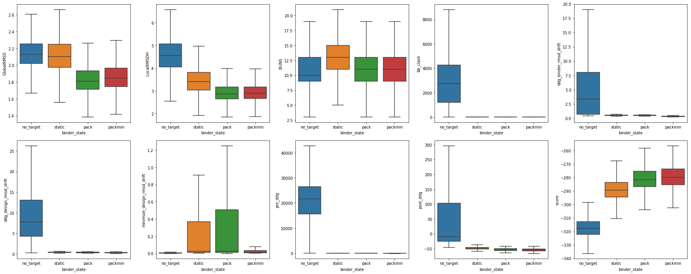

```python
# Default Libraries
import os
import StringIO

# External Libraries
import pandas as pd
import numpy as np
import matplotlib
import matplotlib.pyplot as plt
import seaborn as sns
import networkx as nx
from IPython.display import FileLink, FileLinks

# Own Libraries
import rstoolbox  # Learn about this library at: http://lpdi-epfl.github.io/RosettaSilentToolbox

import readme

# Global Parameters
plt.rcParams['svg.fonttype'] = 'none'
rstoolbox.utils.format_Ipython()
```


<style>
table.dataframe {
    font-family: monospace;
}
</style>


# Target-biased folding and design of protein binders

In this benchmark we will mimic the generation of the BCL2-homologue binder **BINDI**, which structure can be found in [4OYD](pdbs/4oyd.pdb.gz).

We will generate the design using [3LHP](pdbs/3lhp.pdb.gz) as template and [2WH6](pdbs/2wh6.pdb.gz) as the motif source.

We will test **four** different conditions: withouth the target binder (**no_target**), with the target fixed (**static**), allowing repacking of the target (**pack**) or allowing repacking and minimization of the target (**packmin**).

## Generating the designs

The designs are generated with the RosettaScript [4oydMimic.classicFFL.xml](scripts/4oydMimic.classicFFL.xml), using the [SLURM](https://slurm.schedmd.com/)-based submiter script [submiter.ffl.cscs.sh](scripts/submiter.ffl.cscs.sh). This RosettaScript allows through script variable to call for the different conditions needed in this benchmark.

## Evaluating the designs

There are four extra evaluations performed to the designs:

1. **Clash with the binder:** Done with [binder_clash.xml](scripts/binder_clash.xml), it evaluates *"current ddg"*. In the case of the **no_target** this will mean first adding the binder through homology docking guided by the binding motif.

2. **Minimized ddG:** Done with [binder_evaluate.xml](scripts/binder_evaluate.xml). After all populations have a target, both design and target are minimized. Data, from ddG to RMSD drift for both partners is recorded.

3. **Extra RMSD:** Done with [extra_rmsd.xml](scripts/extra_rmsd.xml). Performs localized comparissons between the desings and **BINDI** after aligning them through the binding motif.

4. **Lone Minimization:** Done with [minimize_evaluate.xml](scripts/minimize_evaluate.xml). Removes the target from all designs and allows full protein minimization. Aims to show that the designs folded in the presence of the target are still stable without it.

In-detail analysis of this benchmark if fully described in the paper.


```python
df = readme.get_data()
```


```python
df.groupby(["binder_state"]).mean()
```


<div>
<style scoped>
    .dataframe tbody tr th:only-of-type {
        vertical-align: middle;
    }

    .dataframe tbody tr th {
        vertical-align: top;
    }

    .dataframe thead th {
        text-align: right;
    }
</style>
<table border="1" class="dataframe">
  <thead>
    <tr style="text-align: right;">
      <th></th>
      <th>BUNS</th>
      <th>GlobalRMSD</th>
      <th>LocalRMSD</th>
      <th>LocalRMSDH</th>
      <th>LocalRMSDL</th>
      <th>RMSDTargetH1</th>
      <th>RMSDTargetH13</th>
      <th>RMSDTargetH2</th>
      <th>RMSDTargetH3</th>
      <th>RMSDTargetHL1</th>
      <th>RMSDTargetHL13</th>
      <th>RMSDTargetHL2</th>
      <th>RMSDTargetHL3</th>
      <th>bb_clash</th>
      <th>cav_vol</th>
      <th>cluster</th>
      <th>ddg_binder_rmsd_drift</th>
      <th>ddg_cav_vol</th>
      <th>ddg_design_rmsd_drift</th>
      <th>ddg_design_score</th>
      <th>ddg_packstat</th>
      <th>decoy</th>
      <th>driftRMSD</th>
      <th>min_cav_vol</th>
      <th>min_clash</th>
      <th>min_design_score</th>
      <th>min_packstat</th>
      <th>minimize_design_rmsd_drift</th>
      <th>packstat</th>
      <th>post_ddg</th>
      <th>pre_ddg</th>
      <th>score</th>
    </tr>
    <tr>
      <th>binder_state</th>
      <th></th>
      <th></th>
      <th></th>
      <th></th>
      <th></th>
      <th></th>
      <th></th>
      <th></th>
      <th></th>
      <th></th>
      <th></th>
      <th></th>
      <th></th>
      <th></th>
      <th></th>
      <th></th>
      <th></th>
      <th></th>
      <th></th>
      <th></th>
      <th></th>
      <th></th>
      <th></th>
      <th></th>
      <th></th>
      <th></th>
      <th></th>
      <th></th>
      <th></th>
      <th></th>
      <th></th>
      <th></th>
    </tr>
  </thead>
  <tbody>
    <tr>
      <th>no_target</th>
      <td>10.645954</td>
      <td>2.151566</td>
      <td>4.770413</td>
      <td>4.719378</td>
      <td>3.711406</td>
      <td>5.064217</td>
      <td>5.650077</td>
      <td>2.185332</td>
      <td>6.138954</td>
      <td>4.013761</td>
      <td>4.515533</td>
      <td>1.031468</td>
      <td>4.992342</td>
      <td>3704.490899</td>
      <td>72.997689</td>
      <td>33770.857143</td>
      <td>5.598507</td>
      <td>304.239200</td>
      <td>9.715436</td>
      <td>3964.584411</td>
      <td>0.623328</td>
      <td>286.5</td>
      <td>1.222154</td>
      <td>42.819340</td>
      <td>3723.484381</td>
      <td>-97.064495</td>
      <td>0.649343</td>
      <td>0.011258</td>
      <td>0.611599</td>
      <td>3250.444435</td>
      <td>23118.470380</td>
      <td>-317.114426</td>
    </tr>
    <tr>
      <th>pack</th>
      <td>11.477772</td>
      <td>2.007488</td>
      <td>3.584016</td>
      <td>3.358317</td>
      <td>2.549148</td>
      <td>3.719662</td>
      <td>3.789743</td>
      <td>2.314444</td>
      <td>3.827599</td>
      <td>3.088858</td>
      <td>3.048557</td>
      <td>0.994794</td>
      <td>2.956591</td>
      <td>-0.522198</td>
      <td>332.850372</td>
      <td>37108.971429</td>
      <td>0.537957</td>
      <td>376.985835</td>
      <td>0.392404</td>
      <td>-282.758925</td>
      <td>0.582822</td>
      <td>286.5</td>
      <td>0.967775</td>
      <td>1.152533</td>
      <td>23.642614</td>
      <td>-97.013998</td>
      <td>0.716389</td>
      <td>0.250825</td>
      <td>0.580166</td>
      <td>-46.502266</td>
      <td>-46.876536</td>
      <td>-278.813494</td>
    </tr>
    <tr>
      <th>packmin</th>
      <td>11.474326</td>
      <td>2.022156</td>
      <td>3.540686</td>
      <td>3.328715</td>
      <td>2.543151</td>
      <td>3.675270</td>
      <td>3.768476</td>
      <td>2.267026</td>
      <td>3.828166</td>
      <td>3.077268</td>
      <td>3.040834</td>
      <td>0.999860</td>
      <td>2.954572</td>
      <td>-0.459576</td>
      <td>330.959053</td>
      <td>42384.914286</td>
      <td>0.344020</td>
      <td>362.287564</td>
      <td>0.336624</td>
      <td>-283.277633</td>
      <td>0.583928</td>
      <td>286.5</td>
      <td>0.986022</td>
      <td>1.103162</td>
      <td>23.817923</td>
      <td>-94.872507</td>
      <td>0.718864</td>
      <td>0.135840</td>
      <td>0.582198</td>
      <td>-47.952486</td>
      <td>-55.762767</td>
      <td>-277.394847</td>
    </tr>
    <tr>
      <th>static</th>
      <td>13.153247</td>
      <td>2.292051</td>
      <td>4.066531</td>
      <td>3.799188</td>
      <td>2.675837</td>
      <td>4.164249</td>
      <td>4.322228</td>
      <td>2.533750</td>
      <td>4.442876</td>
      <td>3.193307</td>
      <td>3.212538</td>
      <td>0.993440</td>
      <td>3.192598</td>
      <td>-0.539167</td>
      <td>323.560895</td>
      <td>37819.085714</td>
      <td>0.533314</td>
      <td>388.295518</td>
      <td>0.406066</td>
      <td>-293.721804</td>
      <td>0.602167</td>
      <td>286.5</td>
      <td>1.369097</td>
      <td>0.699613</td>
      <td>6.678909</td>
      <td>-98.885686</td>
      <td>0.656860</td>
      <td>0.172529</td>
      <td>0.595600</td>
      <td>-47.769662</td>
      <td>-42.803151</td>
      <td>-287.496443</td>
    </tr>
  </tbody>
</table>
</div>


```python
readme.plot_preview(df)    
```





# BINDI Deep-Sequence Comparisson

The scoring is performed using as a PSSM the provided deep-sequence scoring matrix: [BINDI-deep-seq-analysis.csv](BINDI-deep-seq-analysis.csv), and fully explained in the text.
