```python
%load_ext autoreload
%reload_ext autoreload
%autoreload 2
```


```python
import warnings; warnings.simplefilter('ignore')
import matplotlib
import matplotlib.pyplot as plt
import rstoolbox
import pandas as pd
import seaborn as sns
import numpy as np
import copy
import glob
import os

sns.set(font_scale=1.5)
matplotlib.rcParams['svg.fonttype'] = 'none'
pd.set_option('display.max_columns', None)
sns.set_style("whitegrid")
```


```python
def make_pyramid_table(df, sse):
    data = {"groups":   sse,
            "template": [0] * len(sse),
            "query":    [0] * len(sse)
           }
    total = df.shape[0]
    for i, s in enumerate(sse):
        data["query"][i]    = (df[df[s]==True].shape[0] / float(total))
        data["template"][i] = (df[df[s]==False].shape[0] / float(total)) * -1
    return pd.DataFrame(data)
```


```python
def plot_pyramid(wdf1, wdf2, sselist, rmsd_max, filename=None):
    fig  = plt.figure(figsize=(20, 5))
    grid = (1, 5)
    ax11 = plt.subplot2grid(grid, (0, 0), colspan=3)
    sns.barplot(x="template",y="groups",data=wdf1, ax=ax11)
    sns.barplot(x="query",y="groups",data=wdf1, ax=ax11)
    ax11.set_xlim(-1, 1)
    ax11.set_xlabel("decoys")
    ax11.set_ylabel("secondary structure")
    ax11.set_yticklabels(sselist)
    ax11.set_xticklabels([1, 0.75, 0.5, 0.25, 0, 0.25, 0.5, 0.75, 1])
    ax11.axvline(x=0, ymin=0, ymax=3, c="black", linewidth=2, zorder=10)
    ax11.annotate("Template   |   Query     ", xy=(0.5, 1), xytext=(0, 5),
                    xycoords='axes fraction', textcoords='offset points', ha='center', va='baseline')
    ax12 = plt.subplot2grid(grid, (0, 3))
    sns.boxplot(x="source", y="rmsd", data=wdf2[(wdf2["sse"]=="global")], showfliers=False, ax=ax12, order=["template", "query"])
    ax12.set_ylim(0, rmsd_max)
    ax12.annotate("Global RMSD", xy=(0.5, 1), xytext=(0, 5),
                    xycoords='axes fraction', textcoords='offset points', ha='center', va='baseline')
    ax22 = plt.subplot2grid(grid, (0, 4))
    sns.boxplot(x="source", y="rmsd", data=wdf2[(wdf2["sse"]=="sseA")],  showfliers=False, ax=ax22, order=["template", "query"])
    ax22.set_ylim(0, rmsd_max)
    ax22.annotate("Aligned by Motif RMSD", xy=(0.5, 1), xytext=(0, 5),
                    xycoords='axes fraction', textcoords='offset points', ha='center', va='baseline')

    plt.tight_layout()
    if filename is not None:
        plt.savefig(filename)
    sns.plt.show()
```


```python
def plot_boxplots( df, rmsd_max, filename=None ):
    fig = plt.figure(figsize=(35, 20))
    ax1 = plt.subplot2grid((1,2), (0, 0))
    ax2 = plt.subplot2grid((1,2), (0, 1))
    sns.boxplot(x="sse", y="rmsd", data=df[df["source"] == "template"], 
                showfliers=False, ax=ax1)
    sns.boxplot(x="sse", y="rmsd", data=df[df["source"] == "query"],
                showfliers=False, ax=ax2)
    ax1.set_ylim(0, rmsd_max)
    ax1.annotate("to Template", xy=(0.5, 1), xytext=(0, 5), xycoords='axes fraction',
                 textcoords='offset points', ha='center', va='baseline')
    ax2.set_ylim(0, rmsd_max)
    ax2.annotate("to Query", xy=(0.5, 1), xytext=(0, 5), xycoords='axes fraction',
                 textcoords='offset points', ha='center', va='baseline')
    plt.tight_layout()
    if filename is not None:
        plt.savefig(filename)
    sns.plt.show()
```

# PF00586

The main issue with this example is that, actually, insertions can be considered both ways and is, thus, difficult to evaluate.

## Pfam Alignment

|  id   |         pdb    |        name   | seq |
|:-----:|:--------------:|:-------------:|:----|
|PF00586|3FD6B;<br>60-180|   SPS1_HUMAN  |   ```.................vmprlgigmdtcviplrhgglsLVQTTDYIYPIVDDPYMM.................GRIACANVLSDLYAMGVTECdNMLMLLGVSnkmtdrerdkVMPLIIQGFKDAAEEAGTSVTGGQTVLNPW......IVLG.......gvattvc```|
|PF00586|3P4EA;<br>18-165|PUR5_VIBCH|    ```dagnalverikgavkrtrrpevmgglggfgalcelptky.......KHPVLVSGTDGvgtklrlaldmkkhdtIGIDLVAMCVNDLIVQGAEPL.FFLDYYATGkl.....dvdTAAEVISGIADGCLQAGCALIGGETAEMPGmyegedYDVAGFCVGVV.......```|


## Design Alignment
|||
|---|---|
|__```SEQUENCE```__   |    ```DTCVIPLRHGGLSLVQTTDYVGTKLRLALDMKKHDTIGRIACANVLSDLYAMGVTECDNMLMLLGVSNKMTDRERDKVMPLIIQGFKDAAEEAGTSVTGGQTVLNPWIVLGGVATTVC```|
|__```STRUCTURE```__  |    ```LLEEEELLLLLLEEEEEEEELHHHHHHHHHLLLLLLHHHHHHHHHHHHHHHLLLLLLEEEEEEEEELLLLHHHHHHHHHHHHHHHHHHHHHLLLLEEEEEEEEELLLEEEEEEEEELL```|
|__```FLEXIBLE```__   |    ```····················**·············**·················································································```|
|__```HOTSPOT```__    |    ```····················*****************·················································································```|
|__```MOTIF```__      |    ```····················*****************·················································································```|
|__```TEMPLATE```__   |    ```********************·················*********************************************************************************```|
|__```CONSTRAINTS```__|    ```********************·················*********************************************************************************```|
|__```MVMP_BB```__    |    ```**********************.............***********************************************************************************```|
|__```MVMP_CHI```__   |    ```********************.................*********************************************************************************```|

## Structure View

|        template          |    query(motif source)   |
|:------------------------:|:------------------------:|
|        __3FD6B__         |        __3P4EA__         |
|||


```python
pf00586 = rstoolbox.io.parse_rosetta_file("pf00586/pf00586.minisilent.gz")
pf00586 = pf00586.assign(counterID=pd.Series(range(0,pf00586.shape[0] + 1)))
pf00586 = pf00586.assign(sse1=pf00586.tmpb1<=pf00586.smpb1,
                         sse2=pf00586.tmpb2<=pf00586.smpb2,
                         sse3=pf00586.tmpb3<=pf00586.smpb3,
                         sseA=pf00586.tmpbA<=pf00586.smpbA)
pf00586.head()
```


<div>
<table border="1" class="dataframe">
  <thead>
    <tr style="text-align: right;">
      <th></th>
      <th>A_ni_mtcontacts</th>
      <th>A_ni_rmsd</th>
      <th>A_ni_rmsd_threshold</th>
      <th>A_ni_rmsd_type</th>
      <th>A_ni_trials</th>
      <th>BUNS</th>
      <th>cav_vol</th>
      <th>description</th>
      <th>design_score</th>
      <th>dslf_fa13</th>
      <th>fa_atr</th>
      <th>fa_dun</th>
      <th>fa_elec</th>
      <th>fa_intra_rep</th>
      <th>fa_rep</th>
      <th>fa_sol</th>
      <th>hbond_bb_sc</th>
      <th>hbond_lr_bb</th>
      <th>hbond_sc</th>
      <th>hbond_sr_bb</th>
      <th>omega</th>
      <th>p_aa_pp</th>
      <th>packstat</th>
      <th>pro_close</th>
      <th>rama</th>
      <th>ref</th>
      <th>rmsd_drift</th>
      <th>score</th>
      <th>sglob</th>
      <th>smpb1</th>
      <th>smpb2</th>
      <th>smpb3</th>
      <th>smpb4</th>
      <th>smpbA</th>
      <th>time</th>
      <th>tmpb1</th>
      <th>tmpb2</th>
      <th>tmpb3</th>
      <th>tmpb4</th>
      <th>tmpbA</th>
      <th>yhh_planarity</th>
      <th>counterID</th>
      <th>sse1</th>
      <th>sse2</th>
      <th>sse3</th>
      <th>sseA</th>
    </tr>
  </thead>
  <tbody>
    <tr>
      <th>0</th>
      <td>31.0</td>
      <td>0.453</td>
      <td>5.0</td>
      <td>no_motif</td>
      <td>1.0</td>
      <td>29.0</td>
      <td>142.101</td>
      <td>3fd6B_0001</td>
      <td>-217.709</td>
      <td>0.0</td>
      <td>-537.263</td>
      <td>157.683</td>
      <td>-67.181</td>
      <td>1.003</td>
      <td>62.420</td>
      <td>302.675</td>
      <td>-10.609</td>
      <td>-26.032</td>
      <td>-13.570</td>
      <td>-33.308</td>
      <td>10.741</td>
      <td>-23.869</td>
      <td>0.579</td>
      <td>0.539</td>
      <td>-8.397</td>
      <td>-10.752</td>
      <td>2.382</td>
      <td>-195.900</td>
      <td>2.324</td>
      <td>3.849</td>
      <td>2.954</td>
      <td>4.127</td>
      <td>2.595</td>
      <td>3.439</td>
      <td>1507.0</td>
      <td>7.281</td>
      <td>4.151</td>
      <td>4.818</td>
      <td>3.279</td>
      <td>5.104</td>
      <td>0.021</td>
      <td>0</td>
      <td>False</td>
      <td>False</td>
      <td>False</td>
      <td>False</td>
    </tr>
    <tr>
      <th>1</th>
      <td>31.0</td>
      <td>1.756</td>
      <td>5.0</td>
      <td>no_motif</td>
      <td>1.0</td>
      <td>27.0</td>
      <td>104.590</td>
      <td>3fd6B_0002</td>
      <td>-174.198</td>
      <td>0.0</td>
      <td>-527.409</td>
      <td>163.855</td>
      <td>-64.848</td>
      <td>1.081</td>
      <td>60.766</td>
      <td>309.330</td>
      <td>-13.521</td>
      <td>-13.300</td>
      <td>-13.644</td>
      <td>-32.627</td>
      <td>12.218</td>
      <td>-32.129</td>
      <td>0.613</td>
      <td>0.113</td>
      <td>5.562</td>
      <td>-12.838</td>
      <td>3.513</td>
      <td>-157.319</td>
      <td>3.842</td>
      <td>5.521</td>
      <td>4.260</td>
      <td>4.614</td>
      <td>5.359</td>
      <td>4.966</td>
      <td>1285.0</td>
      <td>9.363</td>
      <td>4.944</td>
      <td>3.449</td>
      <td>5.212</td>
      <td>6.148</td>
      <td>0.071</td>
      <td>1</td>
      <td>False</td>
      <td>False</td>
      <td>True</td>
      <td>False</td>
    </tr>
    <tr>
      <th>2</th>
      <td>31.0</td>
      <td>1.429</td>
      <td>5.0</td>
      <td>no_motif</td>
      <td>1.0</td>
      <td>31.0</td>
      <td>111.976</td>
      <td>3fd6B_0003</td>
      <td>-210.813</td>
      <td>0.0</td>
      <td>-513.163</td>
      <td>152.361</td>
      <td>-67.759</td>
      <td>1.075</td>
      <td>54.333</td>
      <td>299.725</td>
      <td>-15.774</td>
      <td>-15.582</td>
      <td>-16.330</td>
      <td>-34.697</td>
      <td>10.306</td>
      <td>-38.797</td>
      <td>0.559</td>
      <td>0.305</td>
      <td>2.458</td>
      <td>-10.941</td>
      <td>2.184</td>
      <td>-192.335</td>
      <td>2.837</td>
      <td>4.456</td>
      <td>5.751</td>
      <td>4.178</td>
      <td>6.596</td>
      <td>5.336</td>
      <td>1302.0</td>
      <td>8.313</td>
      <td>5.052</td>
      <td>3.866</td>
      <td>6.956</td>
      <td>6.284</td>
      <td>0.145</td>
      <td>2</td>
      <td>False</td>
      <td>True</td>
      <td>True</td>
      <td>False</td>
    </tr>
    <tr>
      <th>3</th>
      <td>34.0</td>
      <td>0.545</td>
      <td>5.0</td>
      <td>no_motif</td>
      <td>1.0</td>
      <td>27.0</td>
      <td>69.429</td>
      <td>3fd6B_0004</td>
      <td>-207.371</td>
      <td>0.0</td>
      <td>-554.353</td>
      <td>167.248</td>
      <td>-65.954</td>
      <td>1.206</td>
      <td>55.586</td>
      <td>318.788</td>
      <td>-13.460</td>
      <td>-23.298</td>
      <td>-13.703</td>
      <td>-33.243</td>
      <td>11.185</td>
      <td>-23.632</td>
      <td>0.583</td>
      <td>0.028</td>
      <td>-7.809</td>
      <td>-5.196</td>
      <td>1.618</td>
      <td>-186.591</td>
      <td>1.691</td>
      <td>1.835</td>
      <td>3.151</td>
      <td>5.240</td>
      <td>2.538</td>
      <td>3.435</td>
      <td>1387.0</td>
      <td>5.241</td>
      <td>5.222</td>
      <td>5.767</td>
      <td>3.037</td>
      <td>4.930</td>
      <td>0.013</td>
      <td>3</td>
      <td>False</td>
      <td>False</td>
      <td>False</td>
      <td>False</td>
    </tr>
    <tr>
      <th>4</th>
      <td>29.0</td>
      <td>1.268</td>
      <td>5.0</td>
      <td>no_motif</td>
      <td>1.0</td>
      <td>31.0</td>
      <td>128.014</td>
      <td>3fd6B_0005</td>
      <td>-217.687</td>
      <td>0.0</td>
      <td>-567.643</td>
      <td>180.909</td>
      <td>-83.487</td>
      <td>1.341</td>
      <td>54.919</td>
      <td>340.185</td>
      <td>-12.181</td>
      <td>-18.653</td>
      <td>-17.769</td>
      <td>-33.830</td>
      <td>10.548</td>
      <td>-31.875</td>
      <td>0.559</td>
      <td>0.030</td>
      <td>0.010</td>
      <td>-20.972</td>
      <td>1.992</td>
      <td>-198.398</td>
      <td>2.441</td>
      <td>3.153</td>
      <td>2.470</td>
      <td>2.583</td>
      <td>4.818</td>
      <td>3.388</td>
      <td>1417.0</td>
      <td>6.042</td>
      <td>4.194</td>
      <td>3.939</td>
      <td>5.027</td>
      <td>4.870</td>
      <td>0.070</td>
      <td>4</td>
      <td>False</td>
      <td>False</td>
      <td>False</td>
      <td>False</td>
    </tr>
  </tbody>
</table>
</div>


```python
sp = {"keep":["counterID"],
      "split":[("smpb1", "template", "sse1"),("smpb2", "template", "sse2"),
               ("smpb3","template","sse3"),("smpb4", "template", "sse4"),
               ("tmpb1", "query", "sse1"),("tmpb2","query", "sse2"),
               ("tmpb3", "query", "sse3"),("tmpb4", "query", "sse4"),
               ("tmpbA", "query", "sseA"),("smpb4", "template", "sseA"),
               ("sglob", "query", "global"), ("A_ni_rmsd", "template", "global")],
      "names":["rmsd", "source", "sse"]
     } 
pf00586_split = rstoolbox.utils.split_values(pf00586, sp)
pf00586_pyr   = make_pyramid_table(pf00586, ["sse1", "sse2", "sse3", "sseA"])
```


```python
plot_pyramid(pf00586_pyr, pf00586_split, ["beta1", "beta2", "beta3", "all"], 9)
plot_boxplots(pf00586_split, 12)
```


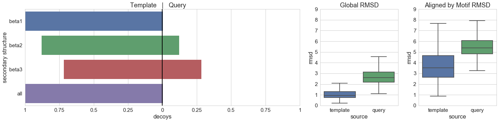


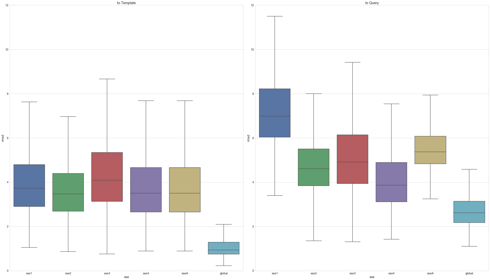


# PF00781

## Pfam Alignment

|  id   |         pdb    |    name   | seq |
|:-----:|:--------------:|:---------:|:----|
|PF00781|3VZDC;<br>16-155|SPHK1_HUMAN| ```RVLVLLNPRGGKGKALQLFrSHVQPLLAEAEISFTLMLTERRNHARELVRSEELGRWDALVVMSGDGLMHEVVNGLMErpdwETAIQKPLCSLPAGSGNALAASLnhyagyeQVTNeDLLTNC...............tlllcrrllspmnllsl```|
|PF00781|3S40A;<br>8-131|Q81KC6_BACAN|```KVLLIVNPKAGQGDLHTNL.TKIVPPLAAAFPDLHILHTKEQGDATKYCQEFAS.KVDLIIVFGGDGTVFECTNGLAP.....LEIRPTLAIIPGGTCNDFSRTL.......GVPQ.NIAEAAKLITKEHVKPVDVAKa................```|

## Design Alignment
### Mode A
|||
|---|---|
|__```SEQUENCE```__|       ```KVLLIVNPKAGQGDLHTNFRSKIVPPLAAAFPDLHILHTKEQGDATKYCQEFALGRVDLIIVFGGDGTVFECTNGLMERPDWETAIQKTLAIIPGGTCNDFSRTLNHYAGYEQVTNEDEAAKLIT```|
|__```STRUCTURE```__|      ```LEEEEELLLLLLLLHHHHHHHHHHHHHHHLLLEEEEELLLLLLHHHHHHHHHLHHLLLEEEEEELHHHHHHHHHHHHHLLLHHHHHHEEEEEELLLLLLHHHHHHHHHLLLLLLLHHHHHHHHLL```|
|__```FLEXIBLE```__|       ```··················*·*································*·*···················**·········**················*············*·······```|
|__```HOTSPOT```__|        ```··················***································***···················*************················**************·······```|
|__```MOTIF```__|          ```··················***································***···················*************················**************·······```|
|__```TEMPLATE```__|       ```******************···********************************···*******************·············****************··············*******```|
|__```CONSTRAINTS```__|    ```******************···********************************···*******************·············****************··············*******```|
|__```MVMP_BB```__|        ```*******************.**********************************.**********************.........*******************............********```|
|__```MVMP_CHI```__|       ```******************...********************************...*******************.............****************..............*******```|
### Mode B
|||
|---|---|
|__```SEQUENCE```__|       ```KVLLIVNPKAGQGDLHTNLTKIVPPLAAAFPDLHILHTKEQGDATKYCQEFASKVDLIIVFGGDGTVFECTNGLMERPDWETAIQKTLAIIPGGTCNDFSRTLNHYAGYEQNIAEAAKLIT```|
|__```STRUCTURE```__|      ```LEEEEELLLLLLLLHHHHHHHHHHHHHHHLLLEEEEELLLLLHHHHHHHHHLLLLLEEEEEELHHHHHHHHHHHHHLLLHHHHHHEEEEEELLLLLLHHHHHHHHHLLLLLHHHHHHHHLL```|
|__```FLEXIBLE```__|       ```·········································································**·········**················*·······*··········```|
|__```HOTSPOT```__|        ```·········································································*************················*********··········```|
|__```MOTIF```__|          ```·········································································*************················*********··········```|
|__```TEMPLATE```__|       ```*************************************************************************·············****************·········**********```|
|__```CONSTRAINTS```__|    ```*************************************************************************·············****************·········**********```|
|__```MVMP_BB```__|        ```***************************************************************************.........*******************.......***********```|
|__```MVMP_CHI```__|       ```*************************************************************************.............****************.........**********```|

## Structure View

|        template          |    query(motif source)   |
|:------------------------:|:------------------------:|
|        __3S40A__         |        __3VZDC__         |
|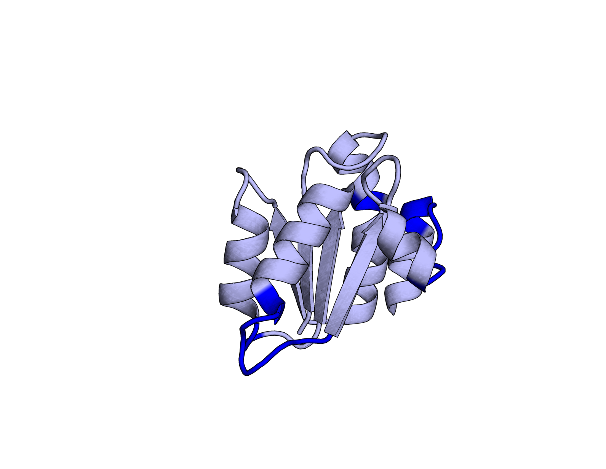||


```python
pf00781 = rstoolbox.io.parse_rosetta_file("pf00781/pf00781*.minisilent.gz", multi=True)
pf00781 = pf00781.assign(counterID=pd.Series(range(0,pf00781.shape[0] + 1)))
pf00781 = pf00781.assign(sse1=pf00781.rmsdQ1<=pf00781.rmsdT1,
                         sse2=pf00781.rmsdQ2<=pf00781.rmsdT2,
                         sse3=pf00781.rmsdQ3<=pf00781.rmsdT3,
                         sse4=pf00781.rmsdQ4<=pf00781.rmsdT4,
                         sse5=pf00781.rmsdQ5<=pf00781.rmsdT5,
                         sse6=pf00781.rmsdQ6<=pf00781.rmsdT6,
                         sse7=pf00781.rmsdQ7<=pf00781.rmsdT7,
                         sse8=pf00781.rmsdQ8<=pf00781.rmsdT8,
                         sse9=pf00781.rmsdQ9<=pf00781.rmsdT9,
                         sseA=pf00781.rmsdQA<=pf00781.rmsdTA)
pf00781.head()
```


<div>
<table border="1" class="dataframe">
  <thead>
    <tr style="text-align: right;">
      <th></th>
      <th>BUNS</th>
      <th>C_ni_mtcontacts</th>
      <th>C_ni_rmsd</th>
      <th>C_ni_rmsd_threshold</th>
      <th>C_ni_rmsd_type</th>
      <th>C_ni_trials</th>
      <th>FFL</th>
      <th>cav_vol</th>
      <th>description</th>
      <th>dslf_fa13</th>
      <th>fa_atr</th>
      <th>fa_dun</th>
      <th>fa_elec</th>
      <th>fa_intra_rep</th>
      <th>fa_rep</th>
      <th>fa_sol</th>
      <th>hbond_bb_sc</th>
      <th>hbond_lr_bb</th>
      <th>hbond_sc</th>
      <th>hbond_sr_bb</th>
      <th>loop_chain_score</th>
      <th>loop_overlap_score</th>
      <th>loop_total_score</th>
      <th>loop_vdw_score</th>
      <th>looprms</th>
      <th>niccd_break_side</th>
      <th>niccd_trials</th>
      <th>omega</th>
      <th>p_aa_pp</th>
      <th>packstat</th>
      <th>pro_close</th>
      <th>qglob</th>
      <th>rama</th>
      <th>ref</th>
      <th>rmsdQ1</th>
      <th>rmsdQ2</th>
      <th>rmsdQ3</th>
      <th>rmsdQ4</th>
      <th>rmsdQ5</th>
      <th>rmsdQ6</th>
      <th>rmsdQ7</th>
      <th>rmsdQ8</th>
      <th>rmsdQ9</th>
      <th>rmsdQA</th>
      <th>rmsdT1</th>
      <th>rmsdT2</th>
      <th>rmsdT3</th>
      <th>rmsdT4</th>
      <th>rmsdT5</th>
      <th>rmsdT6</th>
      <th>rmsdT7</th>
      <th>rmsdT8</th>
      <th>rmsdT9</th>
      <th>rmsdTA</th>
      <th>score</th>
      <th>tglob</th>
      <th>time</th>
      <th>yhh_planarity</th>
      <th>counterID</th>
      <th>sse1</th>
      <th>sse2</th>
      <th>sse3</th>
      <th>sse4</th>
      <th>sse5</th>
      <th>sse6</th>
      <th>sse7</th>
      <th>sse8</th>
      <th>sse9</th>
      <th>sseA</th>
    </tr>
  </thead>
  <tbody>
    <tr>
      <th>0</th>
      <td>38.0</td>
      <td>49.0</td>
      <td>1.140</td>
      <td>5.0</td>
      <td>no_motif</td>
      <td>1.0</td>
      <td>FFLA</td>
      <td>260.526</td>
      <td>3s40A_0001</td>
      <td>0.0</td>
      <td>-475.043</td>
      <td>180.144</td>
      <td>-28.345</td>
      <td>1.102</td>
      <td>934.438</td>
      <td>281.950</td>
      <td>-1.647</td>
      <td>-8.724</td>
      <td>-6.701</td>
      <td>-27.801</td>
      <td>0.413</td>
      <td>0.340</td>
      <td>19.363</td>
      <td>-92.425</td>
      <td>-1.0</td>
      <td>3.0</td>
      <td>1.0</td>
      <td>249.437</td>
      <td>-11.546</td>
      <td>0.392</td>
      <td>4.986</td>
      <td>3.019</td>
      <td>13.495</td>
      <td>-5.790</td>
      <td>1.412</td>
      <td>3.022</td>
      <td>2.326</td>
      <td>4.626</td>
      <td>3.062</td>
      <td>0.444</td>
      <td>3.001</td>
      <td>1.136</td>
      <td>3.427</td>
      <td>3.275</td>
      <td>2.408</td>
      <td>4.545</td>
      <td>4.600</td>
      <td>4.189</td>
      <td>2.955</td>
      <td>0.443</td>
      <td>3.949</td>
      <td>4.078</td>
      <td>7.275</td>
      <td>4.138</td>
      <td>1099.954</td>
      <td>2.791</td>
      <td>1237.0</td>
      <td>0.000</td>
      <td>0</td>
      <td>True</td>
      <td>True</td>
      <td>True</td>
      <td>False</td>
      <td>False</td>
      <td>False</td>
      <td>True</td>
      <td>True</td>
      <td>True</td>
      <td>True</td>
    </tr>
    <tr>
      <th>1</th>
      <td>36.0</td>
      <td>52.0</td>
      <td>0.742</td>
      <td>5.0</td>
      <td>no_motif</td>
      <td>1.0</td>
      <td>FFLA</td>
      <td>191.401</td>
      <td>3s40A_0002</td>
      <td>0.0</td>
      <td>-523.723</td>
      <td>203.712</td>
      <td>-39.214</td>
      <td>1.289</td>
      <td>106.570</td>
      <td>292.761</td>
      <td>-4.878</td>
      <td>-15.195</td>
      <td>-7.951</td>
      <td>-28.732</td>
      <td>0.470</td>
      <td>0.394</td>
      <td>10.811</td>
      <td>-1.797</td>
      <td>-1.0</td>
      <td>3.0</td>
      <td>1.0</td>
      <td>139.738</td>
      <td>-13.048</td>
      <td>0.486</td>
      <td>4.568</td>
      <td>2.850</td>
      <td>3.564</td>
      <td>-8.202</td>
      <td>3.920</td>
      <td>2.991</td>
      <td>5.148</td>
      <td>4.138</td>
      <td>2.965</td>
      <td>1.294</td>
      <td>2.553</td>
      <td>2.185</td>
      <td>3.401</td>
      <td>3.711</td>
      <td>4.624</td>
      <td>6.156</td>
      <td>7.804</td>
      <td>4.147</td>
      <td>4.119</td>
      <td>1.299</td>
      <td>3.397</td>
      <td>4.635</td>
      <td>6.806</td>
      <td>5.285</td>
      <td>111.272</td>
      <td>2.592</td>
      <td>1497.0</td>
      <td>0.013</td>
      <td>1</td>
      <td>True</td>
      <td>True</td>
      <td>True</td>
      <td>True</td>
      <td>True</td>
      <td>True</td>
      <td>True</td>
      <td>True</td>
      <td>True</td>
      <td>True</td>
    </tr>
    <tr>
      <th>2</th>
      <td>30.0</td>
      <td>53.0</td>
      <td>0.647</td>
      <td>5.0</td>
      <td>no_motif</td>
      <td>1.0</td>
      <td>FFLA</td>
      <td>229.650</td>
      <td>3s40A_0003</td>
      <td>0.0</td>
      <td>-525.634</td>
      <td>198.622</td>
      <td>-36.087</td>
      <td>1.203</td>
      <td>133.532</td>
      <td>298.459</td>
      <td>-5.974</td>
      <td>-14.595</td>
      <td>-9.089</td>
      <td>-30.198</td>
      <td>0.625</td>
      <td>0.531</td>
      <td>7.111</td>
      <td>0.000</td>
      <td>-1.0</td>
      <td>3.0</td>
      <td>1.0</td>
      <td>158.994</td>
      <td>-14.063</td>
      <td>0.468</td>
      <td>4.657</td>
      <td>2.382</td>
      <td>5.910</td>
      <td>-3.436</td>
      <td>1.682</td>
      <td>2.427</td>
      <td>1.968</td>
      <td>2.886</td>
      <td>1.366</td>
      <td>1.223</td>
      <td>0.733</td>
      <td>2.764</td>
      <td>3.763</td>
      <td>2.518</td>
      <td>3.317</td>
      <td>4.281</td>
      <td>4.454</td>
      <td>2.680</td>
      <td>3.361</td>
      <td>1.200</td>
      <td>2.808</td>
      <td>4.770</td>
      <td>5.631</td>
      <td>3.708</td>
      <td>162.301</td>
      <td>1.728</td>
      <td>1412.0</td>
      <td>0.000</td>
      <td>2</td>
      <td>True</td>
      <td>True</td>
      <td>True</td>
      <td>False</td>
      <td>True</td>
      <td>False</td>
      <td>True</td>
      <td>True</td>
      <td>True</td>
      <td>True</td>
    </tr>
    <tr>
      <th>3</th>
      <td>39.0</td>
      <td>42.0</td>
      <td>1.166</td>
      <td>5.0</td>
      <td>no_motif</td>
      <td>1.0</td>
      <td>FFLA</td>
      <td>453.888</td>
      <td>3s40A_0005</td>
      <td>0.0</td>
      <td>-426.318</td>
      <td>178.857</td>
      <td>-29.579</td>
      <td>1.000</td>
      <td>1409.765</td>
      <td>262.660</td>
      <td>-6.957</td>
      <td>-3.144</td>
      <td>-3.348</td>
      <td>-24.614</td>
      <td>0.576</td>
      <td>0.489</td>
      <td>96.877</td>
      <td>-58.432</td>
      <td>-1.0</td>
      <td>12.0</td>
      <td>1.0</td>
      <td>206.159</td>
      <td>0.999</td>
      <td>0.313</td>
      <td>6.784</td>
      <td>3.871</td>
      <td>13.815</td>
      <td>-14.233</td>
      <td>6.602</td>
      <td>2.630</td>
      <td>6.472</td>
      <td>7.131</td>
      <td>2.912</td>
      <td>0.757</td>
      <td>1.745</td>
      <td>2.893</td>
      <td>3.700</td>
      <td>4.742</td>
      <td>6.564</td>
      <td>5.793</td>
      <td>8.657</td>
      <td>6.745</td>
      <td>3.269</td>
      <td>0.743</td>
      <td>2.005</td>
      <td>3.436</td>
      <td>5.961</td>
      <td>5.559</td>
      <td>1571.846</td>
      <td>3.580</td>
      <td>1208.0</td>
      <td>0.000</td>
      <td>3</td>
      <td>False</td>
      <td>True</td>
      <td>True</td>
      <td>False</td>
      <td>True</td>
      <td>False</td>
      <td>True</td>
      <td>True</td>
      <td>True</td>
      <td>True</td>
    </tr>
    <tr>
      <th>4</th>
      <td>47.0</td>
      <td>50.0</td>
      <td>0.822</td>
      <td>5.0</td>
      <td>no_motif</td>
      <td>1.0</td>
      <td>FFLA</td>
      <td>313.194</td>
      <td>3s40A_0007</td>
      <td>0.0</td>
      <td>-475.913</td>
      <td>198.637</td>
      <td>-34.265</td>
      <td>1.193</td>
      <td>210.064</td>
      <td>275.257</td>
      <td>-3.465</td>
      <td>-8.990</td>
      <td>-6.022</td>
      <td>-27.237</td>
      <td>0.501</td>
      <td>0.404</td>
      <td>17.422</td>
      <td>-8.304</td>
      <td>-1.0</td>
      <td>12.0</td>
      <td>1.0</td>
      <td>157.526</td>
      <td>-6.636</td>
      <td>0.306</td>
      <td>5.238</td>
      <td>3.197</td>
      <td>11.461</td>
      <td>-9.394</td>
      <td>4.461</td>
      <td>3.141</td>
      <td>5.062</td>
      <td>5.320</td>
      <td>4.243</td>
      <td>0.634</td>
      <td>2.823</td>
      <td>3.433</td>
      <td>3.718</td>
      <td>3.999</td>
      <td>5.208</td>
      <td>5.535</td>
      <td>7.107</td>
      <td>5.181</td>
      <td>4.764</td>
      <td>0.673</td>
      <td>3.947</td>
      <td>6.434</td>
      <td>6.053</td>
      <td>5.366</td>
      <td>287.454</td>
      <td>2.907</td>
      <td>1527.0</td>
      <td>0.000</td>
      <td>4</td>
      <td>True</td>
      <td>True</td>
      <td>True</td>
      <td>False</td>
      <td>True</td>
      <td>True</td>
      <td>True</td>
      <td>True</td>
      <td>True</td>
      <td>True</td>
    </tr>
  </tbody>
</table>
</div>


```python
sp = {"keep":["FFL", "counterID"],
      "split":[("rmsdQ1", "query", "sse1"),("rmsdQ2", "query", "sse2"),
               ("rmsdQ3", "query", "sse3"),("rmsdQ4", "query", "sse4"),
               ("rmsdQ5", "query", "sse5"),("rmsdQ6", "query", "sse6"),
               ("rmsdQ7", "query", "sse7"),("rmsdQ8", "query", "sse8"),
               ("rmsdQ9", "query", "sse9"),("rmsdQA", "query", "sseA"),
               ("rmsdT1", "template", "sse1"),("rmsdT2", "template", "sse2"),
               ("rmsdT3", "template", "sse3"),("rmsdT4", "template", "sse4"),
               ("rmsdT5", "template", "sse5"),("rmsdT6", "template", "sse6"),
               ("rmsdT7", "template", "sse7"),("rmsdT8", "template", "sse8"),
               ("rmsdT9", "template", "sse9"),("rmsdTA", "template", "sseA"),
               ("tglob", "template", "global"),("qglob", "query", "global")],
      "names":["rmsd", "source", "sse"]
     } 

pf00781_split = rstoolbox.utils.split_values(pf00781, sp)
tmp1 = make_pyramid_table(pf00781[pf00781["FFL"]=="FFLA"],
                          ["sse1", "sse2", "sse3", "sse4", "sse5", "sse6", "sse7", "sse8", "sse9", "sseA"])
tmp1 = rstoolbox.utils.add_column(tmp1, "FFL", "FFLA")
tmp2 = make_pyramid_table(pf00781[pf00781["FFL"]=="FFLB"],
                          ["sse1", "sse2", "sse3", "sse4", "sse5", "sse6", "sse7", "sse8", "sse9", "sseA"])
tmp2 = rstoolbox.utils.add_column(tmp2, "FFL", "FFLB")
pf00781_pyr = pd.concat([tmp1, tmp2])
```


```python
plot_pyramid(pf00781_pyr[pf00781_pyr["FFL"]=="FFLA"],
             pf00781_split[(pf00781_split["FFL"]=="FFLA")],
            ["beta1", "helix1", "beta2", "helix2", "beta3", "helix3", "beta4", "helix4", "helix5", "all"], 6)
plot_boxplots(pf00781_split[(pf00781_split["FFL"]=="FFLA")], 11)
```


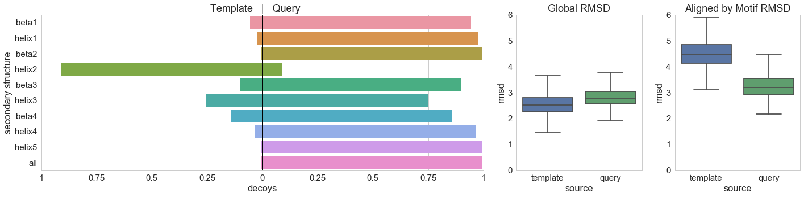


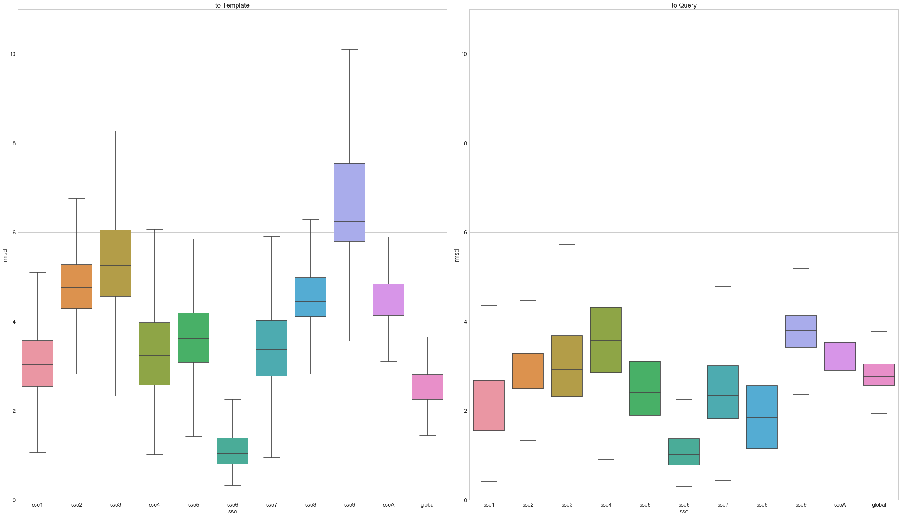


```python
plot_pyramid(pf00781_pyr[pf00781_pyr["FFL"]=="FFLB"],
             pf00781_split[(pf00781_split["FFL"]=="FFLB")],
            ["beta1", "helix1", "beta2", "helix2", "beta3", "helix3", "beta4", "helix4", "helix5", "all"], 8)
plot_boxplots(pf00781_split[(pf00781_split["FFL"]=="FFLB")], 12)
```


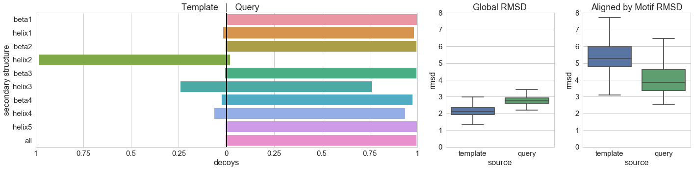


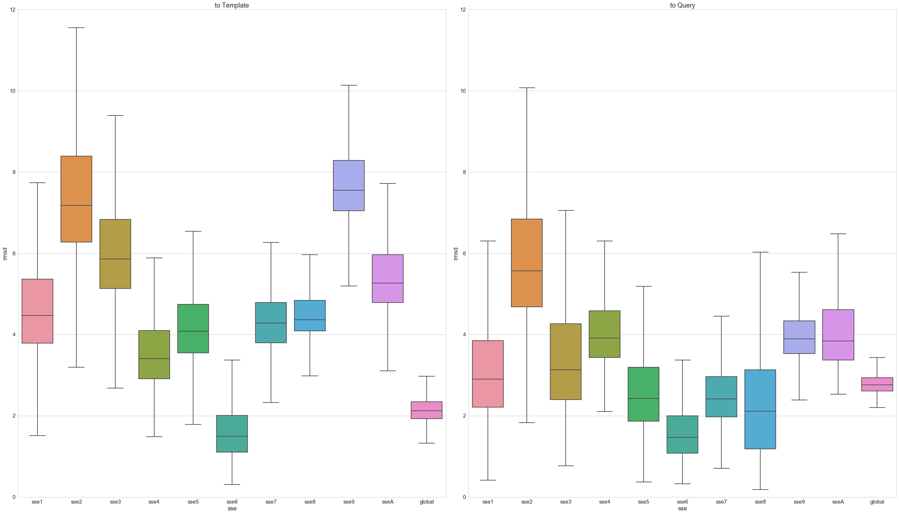


# PF01111

## Pfam Alignment

|  id   |         pdb    |    name   | seq |
|:-----:|:--------------:|:---------:|:----|
|PF01111|4LPAA;<br>28-104|CKS1_YEAST|```IHYSPRYSDDNYEYRHVMLPKAMLKVIPSDyfnsevgtlRILTEDEWRGLGITQSLGWEHYECHAPEPHILLFKRPl```|
|PF01111|1DKSB;<br>6-73  |CKS1_HUMAN|```IYYSDKYDDEEFEYRHVMLPKDIAKLVPKT.........HLMSESEWRNLGVQQSQGWVHYMIHEPEPHILLFRRPl```| 

## Design Alignment

|||
|---|---|
|__```SEQUENCE```__|```IYYSDKYDDEEFEYRHVMLPKDIAKLVPSDYFNSEVGTLRIMSESEWRNLGVQQSQGWVHYMIHEPEPHILLFRRPL```|
|__```STRUCTURE```__|```LEELLLEELLLEEEEEEELLHHHHHHLLHHHELLLLLLELLLHHHHHHHLLLLLLLLEEEELLLLLLLEEEEELELL```|
|__```FLEXIBLE```__|```····························*···········*····································```|
|__```HOTSPOT```__|```····························*************····································```|
|__```MOTIF```__|```····························*************····································```|
|__```TEMPLATE```__|```****************************·············************************************```|
|__```CONSTRAINTS```__|```****************************·············************************************```|
|__```MVMP_BB```__|```*****************************...........*************************************```|
|__```MVMP_CHI```__|```****************************.............************************************```|

## Structure View

|        template          |    query(motif source)   |
|:------------------------:|:------------------------:|
|        __1DKSB__         |        __4LPAA__         |
|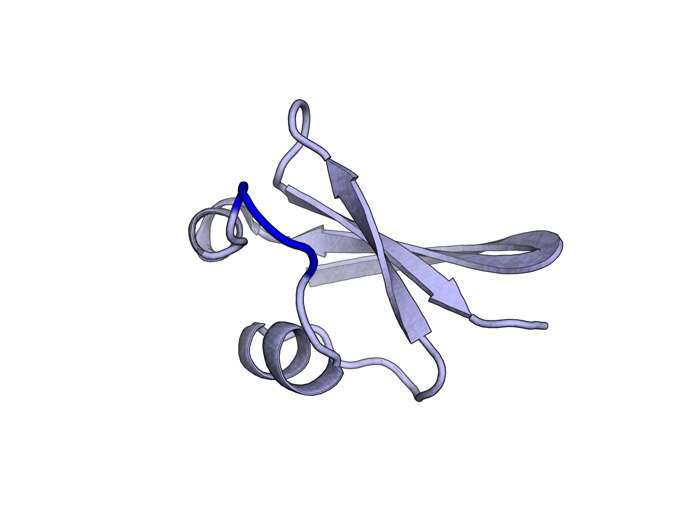|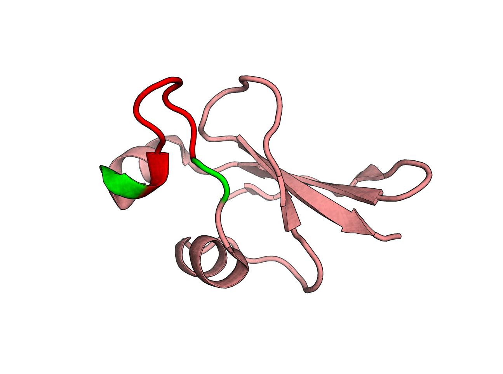|


```python

```

# PF02179

## Pfam Alignment

|  id   |         pdb    |    name   | seq |
|:-----:|:--------------:|:---------:|:----|
|PF02179|4HWCF;<br>161-237|BAG1_ARATH| ```...........ISDISLEVDRL.GGRVSAFEMVTkkg............gkiA.EKD.LVtVIELLMNELIKLDAIVAEGD...VKLQRKMQVKRVQNYVETLDAl```|
|PF02179|3FZMB;<br>155-254|BAG1_HUMAN| ```eevelkklkhl....EKSVEKI.ADQLEELNKELtgiqqgflpkdlqaealcKLDRRVKA.TIEQFMKILEEIDTLILPENfKDSRLKRKGLVKKVQAFLAECDTv```|  

## Design Alignment
### Mode A
|||
|---|---|
|__```SEQUENCE```__|```ISDISLEVDRLGGRVSAFEMVTTGIQQGFLPKDLQAEALCKDLVTVIELLMNELIKLDAIVAEENFKDSRLQRKMQVKRVQNYVETLDAL```|
|__```STRUCTURE```__|```LHHHHHHHHHHHHHHHHHHHHHHHHLLLLLLHHHHHHHHHHHHHHHHHHHHHHHHHHHLLLLLLLLHHHHHHHHHHHHHHHHHHHHHHLL```|
|__```FLEXIBLE```__|```······················*················*·······················*·····*····················```|
|__```HOTSPOT```__|```······················******************·······················*******····················```|
|__```MOTIF```__|```······················******************·······················*******····················```|
|__```TEMPLATE```__|```**********************··················***********************·······********************```|
|__```CONSTRAINTS```__|```**********************··················***********************·······********************```|
|__```MVMP_BB```__|```***********************................*************************.....*********************```|
|__```MVMP_CHI```__|```**********************..................***********************.......********************```|

### Mode B
|||
|---|---|
|__```SEQUENCE```__|```ISDISLEVDRLGGRVSAFEMVTTGIQQGFLPKDLQAEALCKDLVTVIELLMNELIKLDAIVAEGDVKLQRKMQVKRVQNYVETLDAL```|
|__```STRUCTURE```__|```LHHHHHHHHHHHHHHHHHHHHHHHHLLLLLLHHHHHHHHHHHHHHHHHHHHHHHHHHHLLLLHHHHHHHHHHHHHHHHHHHHHHHLL```|
|__```FLEXIBLE```__|```······················*················*···············································```|
|__```HOTSPOT```__|```······················******************···············································```|
|__```MOTIF```__|```······················******************···············································```|
|__```TEMPLATE```__|```**********************··················***********************************************```|
|__```CONSTRAINTS```__|```**********************··················***********************************************```|
|__```MVMP_BB```__|```***********************................************************************************```|
|__```MVMP_CHI```__|```**********************..................***********************************************```|

## Structure View

|        template          |    query(motif source)   |
|:------------------------:|:------------------------:|
|        __4HWCF__         |        __3FZMB__         |
|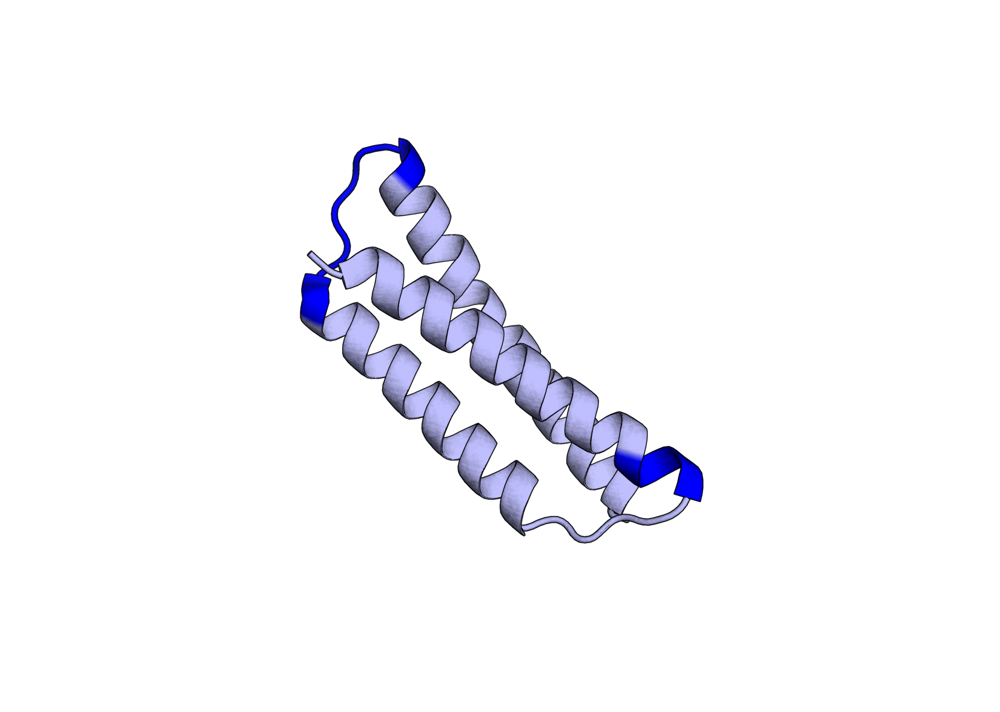|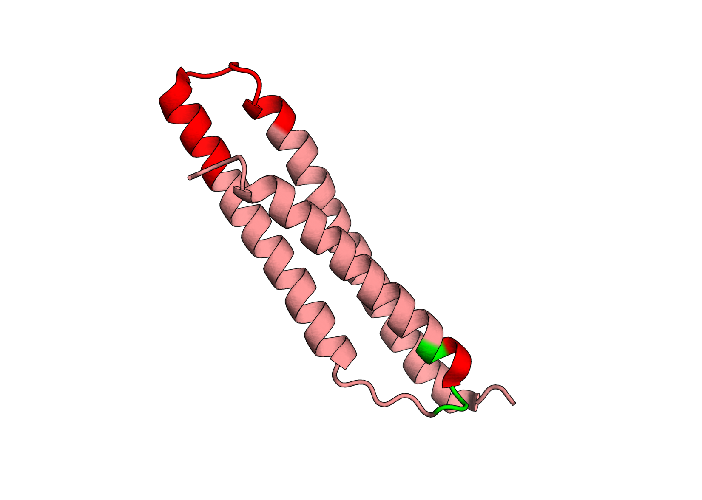|


```python
description = {"scores_ignore": ['loop_chain_score', 'loop_overlap_score', 'loop_total_score',
                                 'loop_vdw_score', 'looprms']
              }
pf02179 = rstoolbox.io.parse_rosetta_file("pf02179/pf02179*.minisilent.gz", description, multi=True)
pf02179 = pf02179.assign(counterID=pd.Series(range(0,pf02179.shape[0] + 1)))
pf02179 = pf02179.assign(sse1=pf02179.rmsdQ1<=pf02179.rmsdT1,
                         sse2=pf02179.rmsdQ2<=pf02179.rmsdT2,
                         sse3=pf02179.rmsdQ3<=pf02179.rmsdT3,
                         sseA=pf02179.rmsdQA<=pf02179.rmsdTA)
pf02179.head()
```


<div>
<table border="1" class="dataframe">
  <thead>
    <tr style="text-align: right;">
      <th></th>
      <th>BUNS</th>
      <th>B_ni_mtcontacts</th>
      <th>B_ni_rmsd</th>
      <th>B_ni_rmsd_threshold</th>
      <th>B_ni_rmsd_type</th>
      <th>B_ni_trials</th>
      <th>FFL</th>
      <th>cav_vol</th>
      <th>description</th>
      <th>dslf_fa13</th>
      <th>fa_atr</th>
      <th>fa_dun</th>
      <th>fa_elec</th>
      <th>fa_intra_rep</th>
      <th>fa_rep</th>
      <th>fa_sol</th>
      <th>hbond_bb_sc</th>
      <th>hbond_lr_bb</th>
      <th>hbond_sc</th>
      <th>hbond_sr_bb</th>
      <th>niccd_break_side</th>
      <th>niccd_trials</th>
      <th>omega</th>
      <th>p_aa_pp</th>
      <th>packstat</th>
      <th>pro_close</th>
      <th>qglob</th>
      <th>rama</th>
      <th>ref</th>
      <th>rmsdQ1</th>
      <th>rmsdQ2</th>
      <th>rmsdQ3</th>
      <th>rmsdQA</th>
      <th>rmsdT1</th>
      <th>rmsdT2</th>
      <th>rmsdT3</th>
      <th>rmsdTA</th>
      <th>score</th>
      <th>tglob</th>
      <th>time</th>
      <th>yhh_planarity</th>
      <th>counterID</th>
      <th>sse1</th>
      <th>sse2</th>
      <th>sse3</th>
      <th>sseA</th>
    </tr>
  </thead>
  <tbody>
    <tr>
      <th>0</th>
      <td>15.0</td>
      <td>10.0</td>
      <td>0.863</td>
      <td>5.0</td>
      <td>no_motif</td>
      <td>1.0</td>
      <td>FFLA</td>
      <td>39.345</td>
      <td>4hwcF_0001</td>
      <td>0.0</td>
      <td>-410.955</td>
      <td>182.566</td>
      <td>-50.743</td>
      <td>0.793</td>
      <td>73.313</td>
      <td>237.465</td>
      <td>-0.485</td>
      <td>0.0</td>
      <td>-11.532</td>
      <td>-51.970</td>
      <td>4.0</td>
      <td>2.0</td>
      <td>47.313</td>
      <td>-3.999</td>
      <td>0.538</td>
      <td>2.494</td>
      <td>1.862</td>
      <td>-7.295</td>
      <td>-22.665</td>
      <td>1.437</td>
      <td>4.272</td>
      <td>2.032</td>
      <td>2.789</td>
      <td>2.759</td>
      <td>5.217</td>
      <td>3.384</td>
      <td>3.870</td>
      <td>-15.699</td>
      <td>1.838</td>
      <td>968.0</td>
      <td>0.000</td>
      <td>0</td>
      <td>True</td>
      <td>True</td>
      <td>True</td>
      <td>True</td>
    </tr>
    <tr>
      <th>1</th>
      <td>16.0</td>
      <td>11.0</td>
      <td>0.727</td>
      <td>5.0</td>
      <td>no_motif</td>
      <td>1.0</td>
      <td>FFLA</td>
      <td>48.871</td>
      <td>4hwcF_0002</td>
      <td>0.0</td>
      <td>-410.123</td>
      <td>183.635</td>
      <td>-38.749</td>
      <td>0.912</td>
      <td>65.103</td>
      <td>234.605</td>
      <td>-1.836</td>
      <td>0.0</td>
      <td>-5.779</td>
      <td>-48.460</td>
      <td>4.0</td>
      <td>2.0</td>
      <td>46.622</td>
      <td>-2.901</td>
      <td>0.500</td>
      <td>2.494</td>
      <td>1.005</td>
      <td>-4.000</td>
      <td>-21.115</td>
      <td>1.506</td>
      <td>3.169</td>
      <td>1.822</td>
      <td>2.244</td>
      <td>2.623</td>
      <td>4.168</td>
      <td>3.035</td>
      <td>3.303</td>
      <td>0.408</td>
      <td>1.041</td>
      <td>965.0</td>
      <td>0.000</td>
      <td>1</td>
      <td>True</td>
      <td>True</td>
      <td>True</td>
      <td>True</td>
    </tr>
    <tr>
      <th>2</th>
      <td>11.0</td>
      <td>13.0</td>
      <td>0.583</td>
      <td>5.0</td>
      <td>no_motif</td>
      <td>1.0</td>
      <td>FFLA</td>
      <td>46.408</td>
      <td>4hwcF_0003</td>
      <td>0.0</td>
      <td>-400.969</td>
      <td>178.230</td>
      <td>-39.185</td>
      <td>0.812</td>
      <td>64.961</td>
      <td>229.328</td>
      <td>-0.451</td>
      <td>0.0</td>
      <td>-5.657</td>
      <td>-51.904</td>
      <td>4.0</td>
      <td>2.0</td>
      <td>87.243</td>
      <td>-3.248</td>
      <td>0.445</td>
      <td>2.494</td>
      <td>0.948</td>
      <td>-3.470</td>
      <td>-20.206</td>
      <td>1.710</td>
      <td>3.443</td>
      <td>2.192</td>
      <td>2.514</td>
      <td>2.553</td>
      <td>4.374</td>
      <td>3.159</td>
      <td>3.403</td>
      <td>37.979</td>
      <td>1.028</td>
      <td>1053.0</td>
      <td>0.000</td>
      <td>2</td>
      <td>True</td>
      <td>True</td>
      <td>True</td>
      <td>True</td>
    </tr>
    <tr>
      <th>3</th>
      <td>17.0</td>
      <td>12.0</td>
      <td>0.814</td>
      <td>5.0</td>
      <td>no_motif</td>
      <td>1.0</td>
      <td>FFLA</td>
      <td>48.871</td>
      <td>4hwcF_0004</td>
      <td>0.0</td>
      <td>-432.099</td>
      <td>187.736</td>
      <td>-50.292</td>
      <td>0.898</td>
      <td>60.982</td>
      <td>245.856</td>
      <td>-0.511</td>
      <td>0.0</td>
      <td>-10.999</td>
      <td>-51.421</td>
      <td>4.0</td>
      <td>2.0</td>
      <td>69.043</td>
      <td>-3.527</td>
      <td>0.547</td>
      <td>2.494</td>
      <td>1.592</td>
      <td>-8.223</td>
      <td>-19.312</td>
      <td>1.533</td>
      <td>3.769</td>
      <td>1.573</td>
      <td>2.467</td>
      <td>2.204</td>
      <td>4.256</td>
      <td>2.896</td>
      <td>3.185</td>
      <td>-9.372</td>
      <td>1.500</td>
      <td>996.0</td>
      <td>0.002</td>
      <td>3</td>
      <td>True</td>
      <td>True</td>
      <td>True</td>
      <td>True</td>
    </tr>
    <tr>
      <th>4</th>
      <td>10.0</td>
      <td>11.0</td>
      <td>0.894</td>
      <td>5.0</td>
      <td>no_motif</td>
      <td>1.0</td>
      <td>FFLA</td>
      <td>59.150</td>
      <td>4hwcF_0005</td>
      <td>0.0</td>
      <td>-440.494</td>
      <td>184.329</td>
      <td>-38.678</td>
      <td>1.009</td>
      <td>415.623</td>
      <td>230.682</td>
      <td>-0.397</td>
      <td>0.0</td>
      <td>-5.707</td>
      <td>-52.855</td>
      <td>4.0</td>
      <td>2.0</td>
      <td>54.123</td>
      <td>-2.865</td>
      <td>0.543</td>
      <td>2.883</td>
      <td>1.458</td>
      <td>-5.015</td>
      <td>-10.401</td>
      <td>1.291</td>
      <td>3.793</td>
      <td>1.615</td>
      <td>2.437</td>
      <td>2.829</td>
      <td>4.825</td>
      <td>3.031</td>
      <td>3.626</td>
      <td>332.236</td>
      <td>1.468</td>
      <td>950.0</td>
      <td>0.000</td>
      <td>4</td>
      <td>True</td>
      <td>True</td>
      <td>True</td>
      <td>True</td>
    </tr>
  </tbody>
</table>
</div>


```python
sp = {"keep":["FFL", "counterID"],
      "split":[("rmsdQ1", "query", "sse1"),("rmsdQ2", "query", "sse2"),
               ("rmsdQ3", "query", "sse3"),("rmsdQA", "query", "sseA"),
               ("rmsdT1", "template", "sse1"),("rmsdT2", "template", "sse2"),
               ("rmsdT3", "template", "sse3"),("rmsdTA", "template", "sseA"),
               ("tglob", "template", "global"),("qglob", "query", "global")],
      "names":["rmsd", "source", "sse"]
     } 
pf02179_split = rstoolbox.utils.split_values(pf02179, sp)
tmp1 = make_pyramid_table(pf02179[pf02179["FFL"]=="FFLA"], ["sse1", "sse2", "sse3", "sseA"])
tmp1 = rstoolbox.utils.add_column(tmp1, "FFL", "FFLA")
tmp2 = make_pyramid_table(pf02179[pf02179["FFL"]=="FFLB"], ["sse1", "sse2", "sse3", "sseA"])
tmp2 = rstoolbox.utils.add_column(tmp2, "FFL", "FFLB")
pf02179_pyr = pd.concat([tmp1, tmp2])
```


```python
plot_pyramid(pf02179_pyr[pf02179_pyr["FFL"]=="FFLA"],
             pf02179_split[(pf02179_split["FFL"]=="FFLA")],
            ["helix1", "helix2", "helix3", "all"], 5)
plot_boxplots(pf02179_split[(pf02179_split["FFL"]=="FFLA")], 7)
```


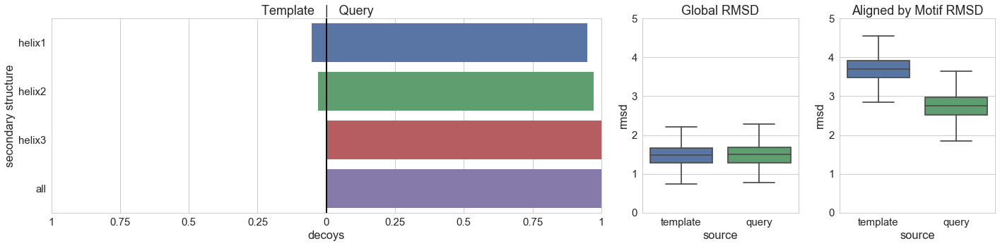


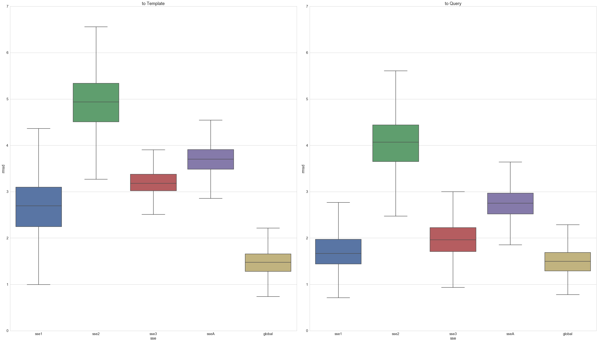


```python
plot_pyramid(pf02179_pyr[pf02179_pyr["FFL"]=="FFLB"],
             pf02179_split[(pf02179_split["FFL"]=="FFLB")],
            ["helix1", "helix2", "helix3", "all"], 15)
plot_boxplots(pf02179_split[(pf02179_split["FFL"]=="FFLB")], 17)
```


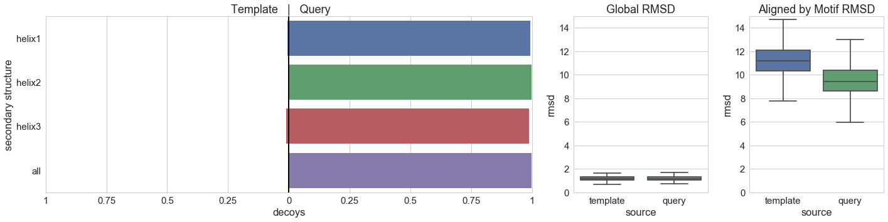


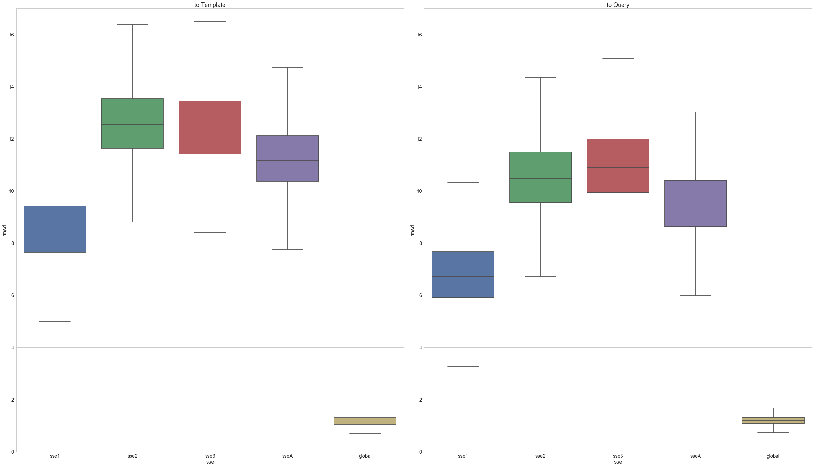


```python

```
